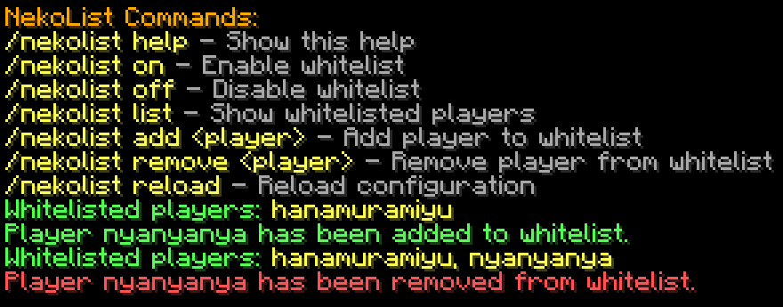
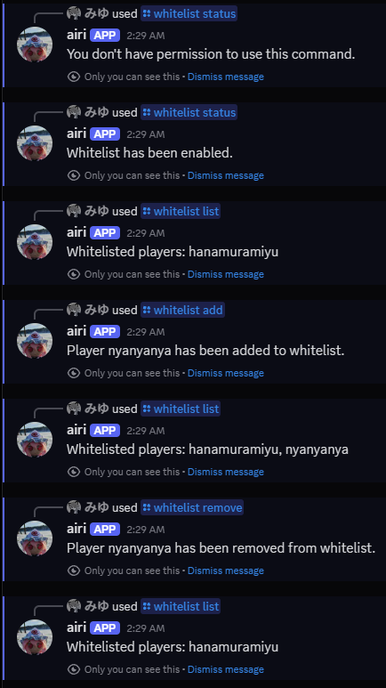

<div align="center">

# 🐾 NekoList - Advanced Whitelist Management


A powerful whitelist management system for Minecraft servers with Discord integration and multi-language support.

</div>

## ✨ Features

### 🎮 In-Game Commands
- **Advanced Whitelist Control** - Replace the default whitelist with enhanced functionality
- **Real-time Management** - Add/remove players without server restart
- **Permission Support** - Works with LuckPerms and other permission plugins
- **Multi-language System** - Support for 13 languages including English, Spanish, Japanese, Russian, Chinese, and more

### 🤖 Discord Integration
- **Slash Commands** - Modern Discord app commands
- **Role-Based Access** - Control who can use bot commands
- **Private Responses** - All commands are ephemeral (visible only to user)
- **Synchronized Language** - Uses same language as Minecraft configuration

### 🌍 Language Support
- **English**: en-US, en-GB
- **Spanish**: es-ES, es-MX, es-AR, es-CL, es-CO, es-PE
- **Japanese**: ja-JP
- **Russian**: ru-RU
- **Ukrainian**: uk-UA
- **Chinese**: zh-CN (Simplified), zh-TW (Traditional)

## 🚀 Quick Start

### Prerequisites
- Java 21 or higher
- Minecraft Server 1.21.x (Paper recommended)
- Gradle (for building)

### Installation
1. Download the latest release from [Releases](https://github.com/hanamuramiyu/NekoList/releases)
2. Place the jar file in your server's `plugins` folder
3. Restart your server
4. Configure the plugin in `plugins/NekoList/config.yml`

### Basic Configuration
```yaml
language: "en-US"

discord-bot:
  enabled: false
  token: "YOUR_BOT_TOKEN_HERE"
  allowed-roles: []
  allowed-users: []
```

## 🎯 Usage

### In-Game Commands
```
/whitelist help - Show command help
/whitelist on - Enable whitelist
/whitelist off - Disable whitelist  
/whitelist list - Show whitelisted players
/whitelist add <player> - Add player to whitelist
/whitelist remove <player> - Remove player from whitelist
/whitelist reload - Reload configuration
```

### Discord Commands
```
/ping - Check bot latency
/whitelist add <player> - Add player to whitelist
/whitelist remove <player> - Remove player from whitelist
/whitelist list - List whitelisted players
/whitelist status - Check whitelist status
```

## 📸 Screenshots

### Minecraft In-Game


*Whitelist management via in-game commands*

### Discord Integration


*Whitelist management via Discord slash commands*

## 🔧 Building from Source

```bash
# Clone the repository
git clone https://github.com/hanamuramiyu/NekoList.git
cd NekoList

# Build the plugin
./gradlew shadowJar

# Output will be in build/libs/NekoList-1.0.0.jar
```

## ⚙️ Configuration

### Language Settings
Choose from 13 supported languages by setting the `language` field in config.yml:
```yaml
language: "en-US"  # Change to your preferred language
```

### Discord Bot Setup
1. Create a bot at [Discord Developer Portal](https://discord.com/developers/applications)
2. Invite the bot to your server with `applications.commands` scope
3. Configure role/user permissions in config.yml

## 🤝 Contributing

We welcome contributions! Please feel free to submit pull requests, report bugs, or suggest new features.

### Adding New Languages
1. Create a new YAML file in `src/main/resources/lang/`
2. Follow the existing language file structure
3. Submit a pull request

## 📄 License

This project is licensed under the MIT License - see the [LICENSE](LICENSE) file for details.

## 🐛 Issue Reporting

Found a bug or have a feature request? Please create an issue on our [GitHub Issues](https://github.com/hanamuramiyu/NekoList/issues) page.

---

<div align="center">

**Made with ❤️ by Hanamura Miyu**

[](https://github.com/hanamuramiyu/NekoList)

</div>